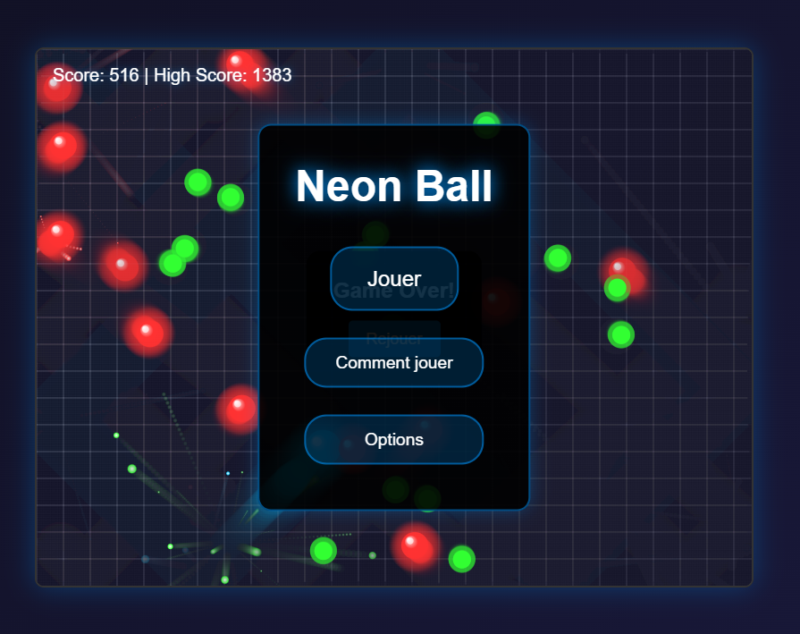

# Ball

Un jeu d'arcade captivant avec une esthétique néon, développé en JavaScript vanilla. Testez vos réflexes en dirigeant une balle lumineuse à travers des obstacles tout en collectant des power-ups.

## 🌟 Caractéristiques

- Design avec effets néon
- Gameplay fluide et réactif
- Compatible PC et mobile
- Système de score et high-score
- Power-ups et bonus
- Effets sonores et musique d'ambiance
- Interface utilisateur intuitive

## 🎯 Comment jouer

### Sur ordinateur
- Utilisez les flèches ⬅️ et ➡️ du clavier pour diriger la balle
- Évitez les obstacles rouges
- Collectez les power-ups pour obtenir des bonus

### Sur mobile
- Touchez l'écran pour diriger la balle
- Interface adaptative pour une expérience mobile optimale

## 🛠️ Installation

1. Clonez le repository
2. Ouvrez le dossier du projet
3. Lancez le jeu en ouvrant `index.html` dans votre navigateur préféré

## 🔧 Technologies utilisées

- HTML5
- CSS3
- JavaScript
- Canvas

## 🎵 Options

Le jeu propose plusieurs paramètres personnalisables :
- Volume de la musique
- Volume des effets sonores
- High scores sauvegardés localement

## 🤝 Contribution

Les contributions sont les bienvenues ! N'hésitez pas à :
1. Fork le projet
2. Créer une branche pour votre fonctionnalité
3. Commit vos changements
4. Push sur la branche
5. Ouvrir une Pull Request

## 📝 License

Ce projet est sous licence MIT - voir le fichier [LICENSE.md](LICENSE.md) pour plus de détails.

## 👨‍💻 Auteur

**Tiavina**
- GitHub: [@Tiavina22](https://github.com/Tiavina22)

## 🙏 Remerciements

- Merci à tous les contributeurs qui auront participé à ce projet
- Inspiré par les jeux d'arcade classiques

## 📱 Compatibilité

- ✅ Chrome
- ✅ Firefox
- ✅ Safari
- ✅ Edge
- ✅ Mobile browsers

---
Développé avec ❤️ par Tiavina